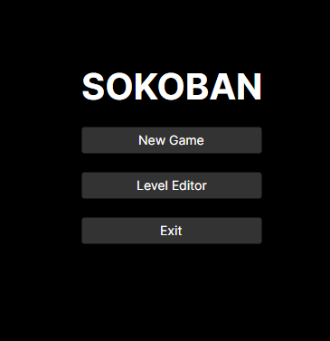
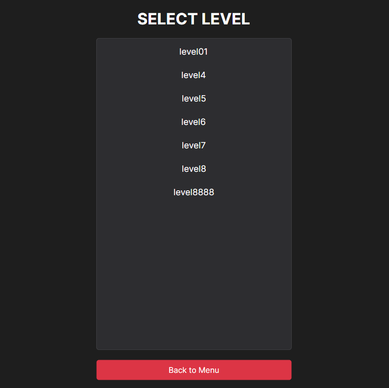
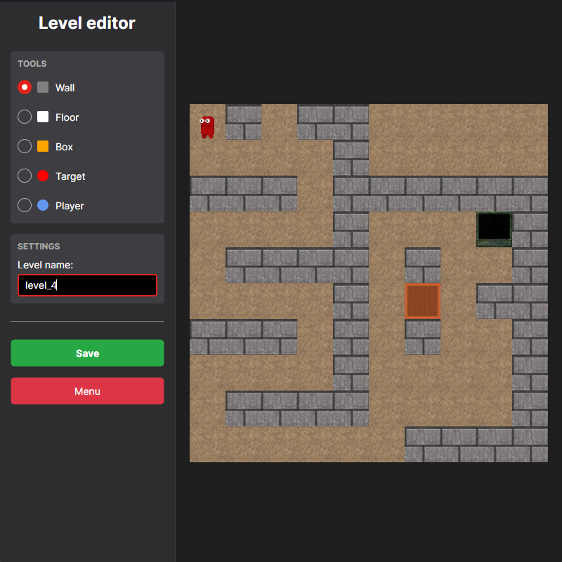
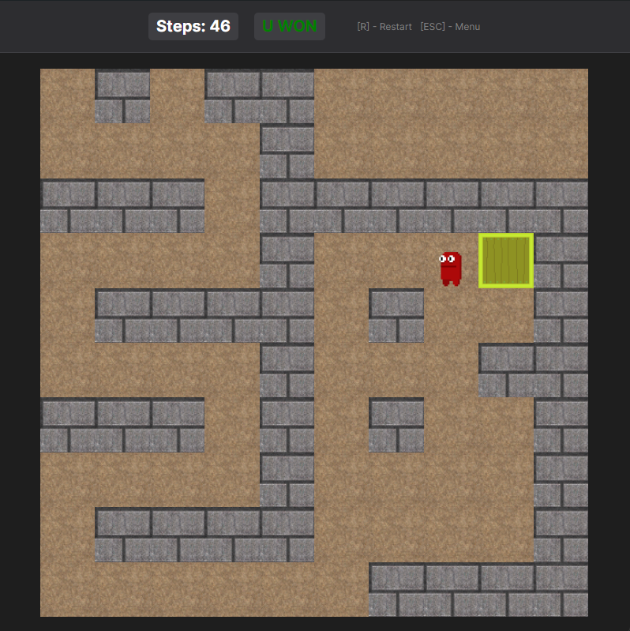

# Курсовой проект "Sokoban" для школы C# от СКБ Контур

## Выполнил: Якимович Владимир Максимович

Реализация MVP классической головоломки **Sokoban**, разработанная с упором на чистую архитектуру и расширяемость.

### Стек:

* Язык: C#
* UI фреймворк Avalonia UI
* Формат JSON для хранения уровней

### Суть игры

Переместите все ящики на карте на специальные target-места чтобы пройти уровень!
Будьте готовы к препядствиям в виде стен.

### Механики геймплея:

* Механика перемещения ящиков, реализованная через толкание
* Система слоев отрисовки
* Система подсчета шагов
* Win condition система

### Удобный редактор уровней позволит вам:

* Самостоятельно создавать уровни в простом конструкторе
* Задавать уровням имена и сохранять в удобном формате (JSON)
* Наслаждаться GUI

## Архитектура

**Sokoban.Logic** - Логическое ядро игры, независящее от UI библиотек, отвечает за правила игры, игровые сущности и валидацию ходов

**Sokoban.UI** - Модуль визуализации на "Avalonia UI". Использует `UserControl` для навигации между меню, редактором и игрой

## Скриншоты

